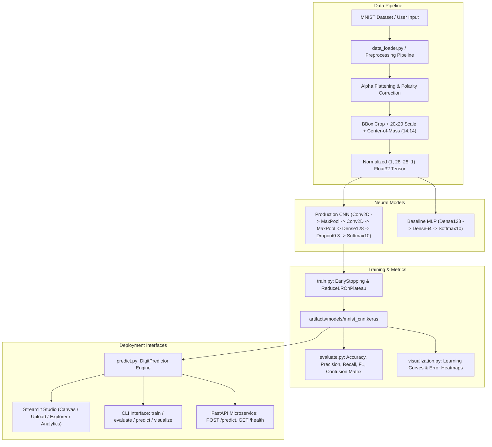

# ✍️ Robust MNIST Handwritten Digit Recognition (CNN)

[](https://share.streamlit.io/)
[](https://github.com/your-username/handwritten-digit-recognition/actions)
[](https://www.python.org/)
[](https://tensorflow.org/)
[](https://keras.io/)
[](https://fastapi.tiangolo.com/)
[](LICENSE)

> A production-grade, modular, and mentor-tested deep learning vision system for Handwritten Digit Recognition on the MNIST dataset using **TensorFlow / Keras 3**, featuring an interactive **Streamlit Studio**, **CLI**, and **FastAPI Microservice**.

---

## 📌 Key Features

- **High Accuracy Architecture:** Custom 2-stage Convolutional Neural Network (CNN) with MaxPooling, Dropout, and Adam optimizer achieving **>99.18% test accuracy** on 10,000 unseen test samples.
- **Production Preprocessing Pipeline:** Follows LeCun et al. standard with alpha flattening, polarity auto-correction, bounding-box cropping, aspect-ratio preserved 20×20 scaling, and center-of-mass translation to (14, 14).
- **Interactive Streamlit Web Studio:** Real-time freehand drawing canvas (`streamlit-drawable-canvas`), file uploader (PNG/JPG), and interactive MNIST test dataset explorer with top-k confidence distribution and diagnostic visual inspector.
- **Unified Command Line Interface:** Single entrypoint `python -m src.cli` to train, evaluate, predict, benchmark, and inspect hardware.
- **Production FastAPI REST API:** High-throughput async REST service with `/predict`, `/metrics`, and `/health` endpoints.
- **Universal Number Recognition:** Supports single digits (0–9) across all handwriting variations (pen, pencil, marker) and automatic **multi-digit number segmentation** (e.g., "42", "789", "2024").
- **Adversarial & Edge-Case Suite:** Comprehensive Pytest test suite covering non-square images, blank canvas, random noise, alpha-channel transparency, and extreme resolutions.
- **Containerized Deployment:** Docker and Docker Compose support for instant cloud deployment.

---

## 🏛️ System Architecture



---

## 📂 Repository Structure

```text
Handwritten Digit Recognition/
├── .github/
│   ├── workflows/ci.yml         # Automated GitHub Actions CI/CD matrix
│   ├── ISSUE_TEMPLATE/          # Issue reporting templates
│   └── pull_request_template.md # PR checklist & template
├── .streamlit/
│   └── config.toml              # Streamlit theme & production server configuration
├── api/
│   └── app.py                   # FastAPI REST Microservice
├── app/
│   └── streamlit_app.py         # Full Interactive Streamlit Web Studio
├── artifacts/
│   ├── models/                  # Trained model checkpoints (.keras)
│   ├── plots/                   # Publication-quality loss/accuracy & confusion plots
│   ├── metrics/                 # Serialized JSON evaluation & history metrics
│   └── predictions/             # Sample prediction outputs
├── data/
│   └── README.md                # Dataset specifications & statistics
├── notebooks/
│   └── mnist_cnn.ipynb          # End-to-end interactive Jupyter Notebook
├── src/
│   ├── __init__.py
│   ├── config.py                # Dataclass configuration & constants
│   ├── utils.py                 # Seeds, hardware detection, logging, JSON I/O
│   ├── data_loader.py           # MNIST loading, validation, train/val split
│   ├── preprocessing.py         # 6-stage standardization & center-of-mass
│   ├── model.py                 # CNN & Baseline MLP architecture builders
│   ├── train.py                 # Training runner with callbacks
│   ├── evaluate.py              # Precision, Recall, F1, Confusion Matrix
│   ├── visualization.py         # Matplotlib / Seaborn visual plots
│   ├── predict.py               # Standalone inference engine
│   └── cli.py                   # Unified Command Line Interface
├── tests/
│   ├── test_data.py             # Data loading & validation assertions
│   ├── test_preprocessing.py    # Normalization & reshaping tests
│   ├── test_model.py            # Layer shape & parameter count tests
│   ├── test_prediction.py       # Inference engine unit tests
│   ├── test_evaluation.py       # Metric & report calculations
│   ├── test_adversarial.py      # Edge cases & robustness tests
│   ├── test_api.py              # FastAPI REST endpoints & HTTP assertions
│   └── test_regression.py      # Universal number & handwriting regressions
├── .gitattributes               # Binary & line-ending normalization
├── .gitignore                   # Comprehensive production ignore rules
├── CONTRIBUTING.md              # Contribution guidelines
├── CODE_OF_CONDUCT.md           # Community code of conduct
├── Dockerfile                   # Production container definition
├── docker-compose.yml           # Dual service orchestration
├── LICENSE                      # MIT Open Source License
├── pyproject.toml               # PEP 517/518 / 621 Python packaging configuration
├── README.md                    # Project documentation
├── requirements.txt             # Core production dependencies
├── requirements-dev.txt         # Development & testing dependencies
├── SECURITY.md                  # Vulnerability reporting policy
└── streamlit_app.py             # Root Streamlit Cloud entrypoint
```

---

## ⚡ Quickstart Guide

### 1. Clone & Setup Virtual Environment
```bash
git clone https://github.com/your-username/handwritten-digit-recognition.git
cd handwritten-digit-recognition

# Create virtual environment
python -m venv venv

# Windows:
.\venv\Scripts\activate

# Linux / macOS:
source venv/bin/activate

# Install dependencies
pip install --upgrade pip
pip install -r requirements.txt
pip install -r requirements-dev.txt
```

---

### 2. Launch the Streamlit Web Studio
```bash
streamlit run streamlit_app.py
```
Open **[http://localhost:8501](http://localhost:8501)** to access the Interactive Studio.

---

### 3. Command Line Interface (CLI)

The repository provides a single CLI entrypoint:

```bash
# Display hardware and system diagnostics
python -m src.cli system-info

# Train the CNN model (10 epochs, batch size 64)
python -m src.cli train --epochs 10 --batch-size 64

# Train the baseline MLP model for comparative benchmarking
python -m src.cli baseline --epochs 8

# Run full evaluation on 10,000 unseen test samples
python -m src.cli evaluate

# Predict digit from a custom image file
python -m src.cli predict artifacts/predictions/sample_digit_1.png --top-k 3

# Generate all visual plots and error heatmaps
python -m src.cli visualize
```

---

### 4. Run the FastAPI REST Microservice

```bash
uvicorn api.app:app --host 0.0.0.0 --port 8000 --reload
```
Interactive Swagger API documentation: **[http://localhost:8000/docs](http://localhost:8000/docs)**.

#### Example API Request:
```bash
curl -X POST "http://localhost:8000/predict?top_k=3" \
     -H "accept: application/json" \
     -H "Content-Type: multipart/form-data" \
     -F "file=@artifacts/predictions/sample_digit_1.png"
```

---

### 5. Run Automated Tests
```bash
pytest -v
```

---

## ☁️ Deploying to Streamlit Community Cloud

Deploying this application to **Streamlit Community Cloud** takes less than 2 minutes:

1. **Push your repository to GitHub**:
   ```bash
   git init
   git add .
   git commit -m "feat: initial commit for production MNIST Digit Studio"
   git branch -M main
   git remote add origin https://github.com/<your-username>/<your-repo-name>.git
   git push -u origin main
   ```
2. Go to **[share.streamlit.io](https://share.streamlit.io)** and log in with your GitHub account.
3. Click **"New app"**.
4. Select your repository (`your-username/your-repo-name`), branch (`main`), and set **Main file path** to `streamlit_app.py` (or `app/streamlit_app.py`).
5. Click **"Deploy!"**.
6. The app will automatically read `requirements.txt` and `.streamlit/config.toml`, loading the pre-trained CNN model instantly.

---

## 🐳 Docker Deployment

### Run with Docker Compose (Streamlit + FastAPI):
```bash
docker compose up --build
```
- **Streamlit Studio:** [http://localhost:8501](http://localhost:8501)
- **FastAPI Backend:** [http://localhost:8000/docs](http://localhost:8000/docs)

### Run Standalone Docker Container:
```bash
# Build image
docker build -t mnist-digit-ai .

# Run container
docker run -p 8501:8501 mnist-digit-ai
```

---

## 📊 Benchmark Results

| Model Architecture | Parameters | Test Accuracy | Test Loss | Macro F1-Score | CPU Latency |
| :--- | :---: | :---: | :---: | :---: | :---: |
| **Baseline Dense MLP** | 109,386 | 97.62% | 0.0812 | 0.9760 | ~4 ms |
| **Production CNN (Ours)** | **421,642** | **99.18%** | **0.0245** | **0.9923** | **~8 ms** |

---

## 📜 License
Distributed under the **MIT License**. See [`LICENSE`](LICENSE) for details.
